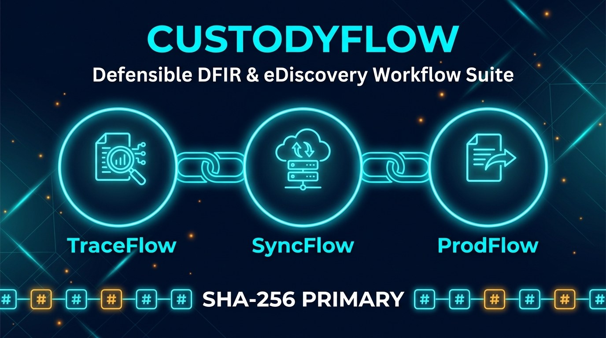
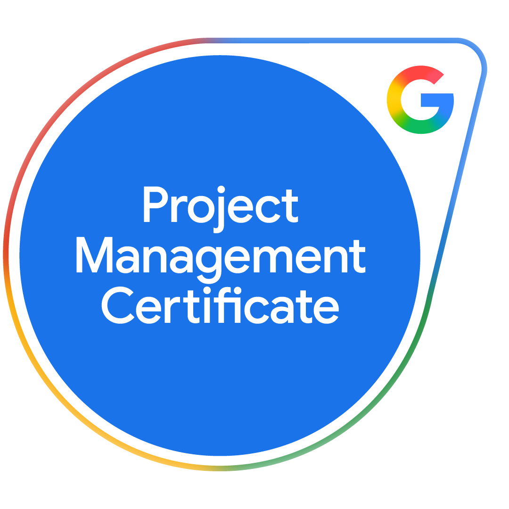

Hi, I'm Ryan C. Hanks 👋

**Digital forensics examiner and eDiscovery practitioner.** Former Lead Digital Forensics Detective (Everett PD, 2011–2025): mobile and video forensics, cloud warrant returns, and courtroom testimony. I build open-source tools that make evidence handling verifiable: SHA-256 hashing, audit trails, and chain-of-custody records aligned with FRE 702/901 and ISO/IEC 27037.

**Open to:** fully remote US roles in digital forensics / DFIR, eDiscovery, forensics-vendor and cybersecurity analyst positions, and IT support. Based in Florida (Eastern time).

Every tool below runs in your browser with no install, and files never leave your device.

---
### 🛠️ Featured Projects

#### CustodyFlow suite

Defensible DFIR and eDiscovery workflow tools. See the **[CustodyFlow overview](https://github.com/ryandus/custodyflow)**.

* **[ProdFlow](https://github.com/ryandus/ProdFlow)** – eDiscovery production QC (Concordance DAT, OPT/LFP), TAR elusion and recall statistics with exact confidence intervals, and matter cost estimates, backed by a tamper-evident SHA-256 audit trail. **[▶ Try it in your browser](https://ryandus.github.io/ProdFlow/)**
* [TraceFlow](https://github.com/ryandus/TraceFlow) – Evidence hash manifest generator and ISO/IEC 27037 chain-of-custody ledger. **[▶ Try it in your browser](https://ryandus.github.io/TraceFlow/)**
* [SyncFlow](https://github.com/ryandus/SyncFlow) – Forensic DVR clock-drift calibrator and timeline synchronizer built for LEVA/SWGDE practice. **[▶ Try it in your browser](https://ryandus.github.io/SyncFlow/)**

#### Other projects

* [EDRM Litigation Forensics Showcase](https://github.com/ryandus/edrm-litigation-forensics-showcase) – Walkthrough linking digital forensics, e-discovery, and legal workflows. **[▶ View it in your browser](https://ryandus.github.io/edrm-litigation-forensics-showcase/)**
* [DFIR Investigation Framework](https://github.com/ryandus/DFIR-Investigation-Framework) – Forensic framework aligned with NIST SP 800-61, ISO/IEC 27037/27042, and FRE 702.
* [SupportTriage](https://github.com/ryandus/SupportTriage) – Ticket triage and escalation-package builder for SaaS support and IT operations teams. **[▶ Try it in your browser](https://ryandus.github.io/SupportTriage/)**
* [Police Report Generator](https://github.com/ryandus/Police-Report-Generator-) – Standardized narrative reporting interface for law enforcement. **[▶ Try it in your browser](https://ryandus.github.io/Police-Report-Generator-/)**

### 🔍 Focus Areas & Tooling

* **Domains:** Digital Forensics & Incident Response (DFIR) • eDiscovery Production QC & TAR Validation • Mobile & Video Forensics • Evidence Preservation • Litigation Support • Workflow Automation
* **Standards:** NIST SP 800-61/86 • ISO/IEC 27037 & 27042 • LEVA / SWGDE • RFC 3227 • FRE 702/901
* **Core Tech:** Python, TypeScript, Bash, Linux, Docker, Git

       

* **Certifications:** Cellebrite Certified Mobile Examiner (CCME), Certified Physical Analyst (CCPA), Certified Operator (CCO) • LEVA Certified Forensic Video Technician • RelativityOne Review Professional • Google Cybersecurity, AI, IT Support, and Project Management Professional Certificates

---
For inquiries or opportunities, connect with me on [LinkedIn](https://www.linkedin.com/in/ryan-c-hanks/).
